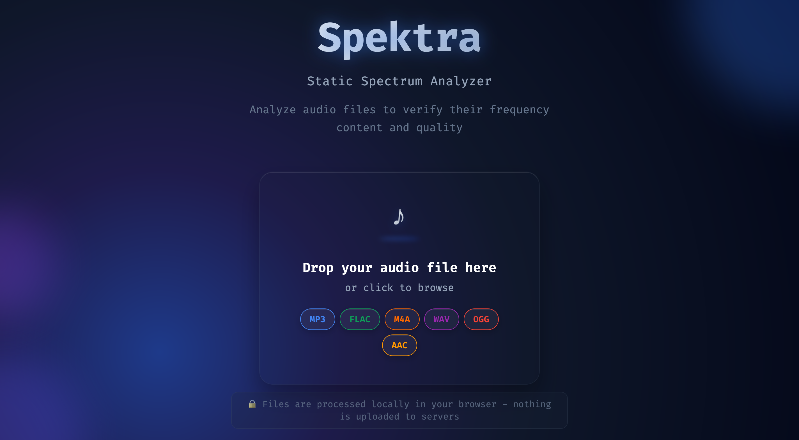
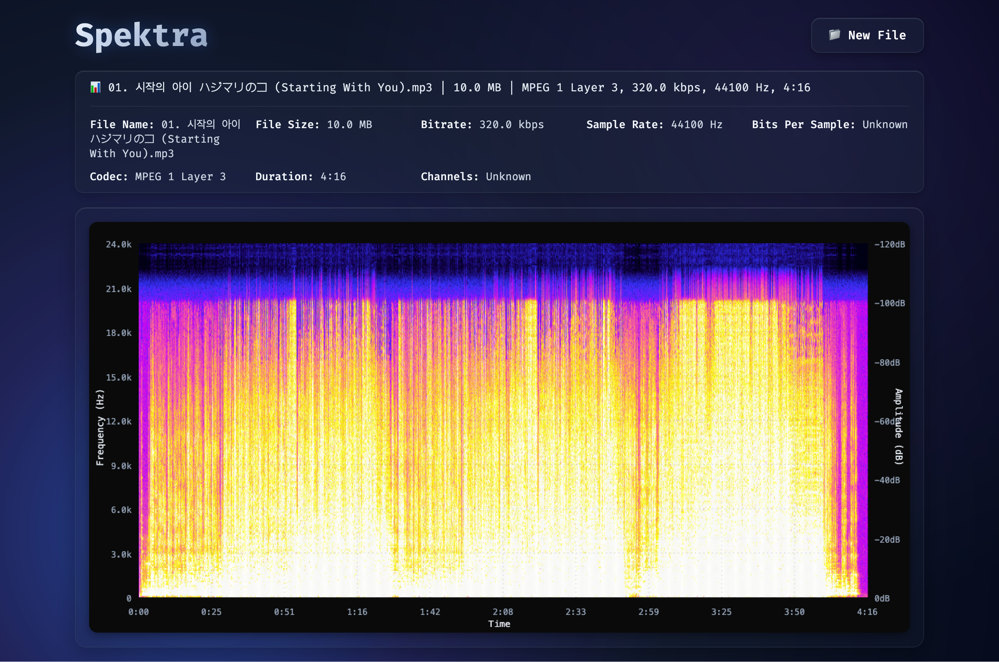

# [Spektra](https://www.seungkilee.com/spektra)





Spektra is a static web-based spectrum analyzer that visualizes audio files using Fast Fourier Transform (FFT) to display frequency content over time. Inspired by tools like Spek, it allows users to upload audio files and view detailed spectrograms with professional-grade features like dB scaling, color mapping, and metadata display. Built as a single-page application (SPA) for easy deployment on platforms like GitHub Pages.

## Motivation

As a passionate audio enthusiast, I've encountered numerous instances where I purchased "FLAC" files from questionable sources, tried them out, and sensed they sounded no different from YouTube, only to discover they were low quality rips with frequency content sharply truncated, commonly around 18 kHz rather than the full spectrum up to 20 kHz or beyond. This experience led me to develop a habit of rigorously verifying the actual frequency range of audio files.

Now, at this point in my audio hobby, I have to add the caveat that I believe a well-engineered 256kbps audio file is effectively indistinguishable from a 16-bit/48kHz FLAC. Nonetheless, the past experiences of buying the fake FLAC files, or the whole ordeal with Tidal and MQA formats and debunking by GoldenSound, still left me with a lingering distrust of online audio vendors.

Old habits die hard, and even when purchasing from trusted platforms like Qobuz, I usually validate that the files truly contain the claimed high fidelity audio data. Tools like [Spek](https://spek.cc) have been invaluable in this regard, but their unavailability on certain platforms like Linux at times, along with the requirement for needing to have the executable installed on your machine led to cumbersome experiences in my rituals of audio data validations. This made me long for a lightweight, cross-platform analyzer accessible anytime.

So naturally, this led to the idea behind Spektra: a lightweight, client-side, static web based audio spectrum analyzer, designed for universal accessibility and ease of use. The idea was to create a trustworthy tool that anyone can use without the hassle of installation or OS limitations.

So my goal was to make "Spek, but for Web."

## Features

- Audio File Upload: Supports MP3, M4A, FLAC, and more via drag-and-drop or file selection.
- Spectrogram Visualization: Displays frequency spectrum with logarithmic dB scaling and Spek-like color mapping.
- Metadata Display: Shows file details like bitrate, sample rate, codec, and duration in a compact, expandable header.
- Professional Labels: Frequency (Hz) on left, dB on right, time on bottom to match industry standards.
- Performance Optimizations: Downsampling for large files to ensure smooth rendering.
- Cross Browser Compatibility: Uses Web Audio API with fallbacks for broad support.
- Static Deployment: Runs entirely client-side with no backend required. Your audio is never stored on any server.

## Demo

Check out [Spektra](https://www.seungkilee.com/spektra) or install and run it yourself.

## Installation

1. Clone the repository:

   ```
   git clone https://github.com/seungkilee-cs/Spektra.git
   cd Spektra
   ```

2. Install dependencies:

   ```
   npm install
   ```

   - Key dependencies: `fft-js` for FFT computations, `music-metadata-browser` for audio metadata extraction.

3. Run locally:

   ```
   npm start
   ```

   Open http://localhost:3000 in your browser.

4. Build for production:
   ```
   npm run build
   ```
   Deploy the `build/` folder to any static host (e.g., GitHub Pages, Netlify).

## Usage

#1. Open the app in your browser. 2. Drag-and-drop or select an audio file (e.g., MP3). 3. View the generated spectrogram with metadata header. 4. Click the header to expand detailed file info.

Example metadata display:

- Compact: "file.mp3 | 10.0 MB | MPEG 1 Layer 3, 320.0 kbps, 44100 Hz, 4:16"
- Expanded: Full JSON-like details for advanced users.

## Technologies

- **Frontend**: React.js for static page web app.
- **Audio Processing**: Web Audio API for decoding audio files.
- Fast Fourier Transform: Custom implementation of FFT in Javascript -> changed to fft-js library -> changed to Rust + WASM custom implementation.
- **Metadata**: music-metadata-browser for extracting audio tags.
- **Visualization**: HTML Canvas for efficient pixel rendering.
- **Build Tools**: Vite for fast development and bundling.

## Current Iterations

Spektra is a prototype with room for enhancement.

### High Priority

- [x] 🦀 Rust + WASM for FFT
      Unoptimized custom implementation of Javascript FFT from scratch was infeasible in performance, and crashed. Even the native JS FFT library is not performant for larger files.
      So I'm working to replace JavaScript FFT with a high-performance Rust implementation compiled to WebAssembly. This could improve processing speed by 3-10x for large files, enabling near-native performance in the browser.

Checkout the [performance differences](./docs/fft-js_rust+wasm_comparison.md).

- [x] Revamp the Ui
      Modernize the UI with a dark theme, responsive design, zoom/pan functionality for spectrograms, and customizable color schemes. Current vibe I am shooting for is "Spek for Web."

- [x] Add More File Format Support
      Want to add support for WAV, OGG, ALAC -> added formats Universally supported browser

- [ ] Responsive Design
      Updating CSS for visuauls and for future mobile support

### Low Priority

- [ ] Mobile optimization and PWA support: To leverage the cross platform strength I want to make the responsive design work with mobile

- [ ] Real-Time Analysis: Add microphone input for live audio visualization, with options for real-time spectrograms and peak detection.

- [ ] Export options (PNG/JPG of spectrogram, CSV of frequency data).

- [ ] Comparative analysis (overlay multiple audio files).

- [ ] Performance Enhancements: If Rust FFT doesn't work as performant as I want it to, I'm looking to delving deeper into multi-threading via Web Workers, GPU acceleration with WebGL for rendering.

## License

This project is licensed under the MIT License. See the [LICENSE](LICENSE) file for details.

---

Built by [seungkilee-cs](https://github.com/seungkilee-cs). Inspired by [Spek](https://spek.cc) and the need for a lightweight, web-based audio analyzer.
